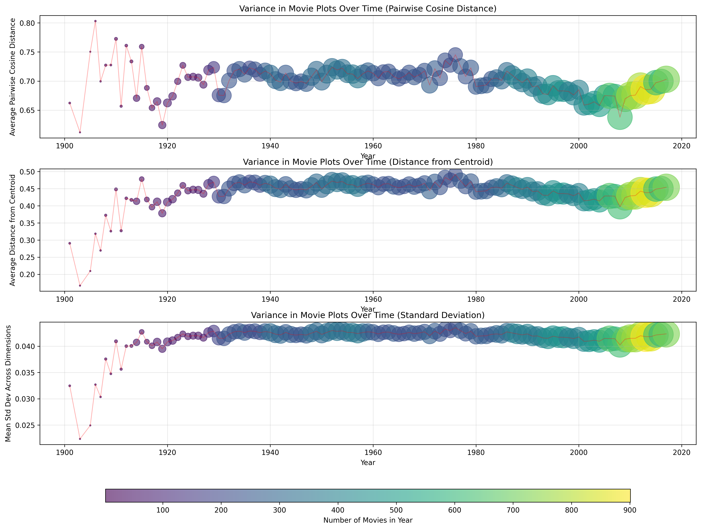

# Movie Plot Embedding Analysis: Variance Over Time

An investigation into whether movie plots have become more diverse over the past century using semantic embeddings.

## Motivation

Are movies becoming more diverse in their storytelling? This experiment tests the hypothesis that **movie plot variance increases over time**, potentially reflecting:
- Greater creative experimentation in modern cinema
- Diversification of genres and subgenres
- Rise of niche and specialized content
- Evolution of storytelling techniques

## Dataset

**Source**: `wiki_movie_plots_deduped.csv` - Wikipedia movie plot summaries
**Size**: 34,886 movies spanning 1901-2020
**Valid embeddings**: 32,524 movies across 115 years

## Methods

### 1. Embedding Generation
- **Model**: `mlx-community/all-MiniLM-L6-v2-4bit` via `mlx-embeddings`
- **Output**: 384-dimensional semantic embeddings for each plot
- Each movie plot is encoded into a vector space where semantic similarity is captured by geometric proximity

### 2. Variance Metrics

For each year, we calculated three complementary measures of plot diversity:

1. **Average Pairwise Cosine Distance**: Mean distance between all pairs of movie embeddings within a year
   - Captures overall spread of the embedding space
   - Higher values = more diverse plots relative to each other

2. **Average Distance from Centroid**: Mean distance of each movie from the year's centroid
   - Measures dispersion from the "average" movie plot of that year
   - Higher values = movies deviate more from the norm

3. **Standard Deviation Across Dimensions**: Mean standard deviation across all embedding dimensions
   - Captures variance in the underlying semantic features
   - Higher values = more variation in story elements

### 3. Temporal Analysis

Movies were grouped by release year, and variance metrics were computed for each year. Results were visualized with dot size representing the number of movies in that year, allowing us to weight our interpretation by sample size.

## Key Findings

### Overall Trends

**The hypothesis is partially supported** - 2 out of 3 metrics show increasing variance over time:

| Metric | Correlation with Year | Trend |
|--------|----------------------|-------|
| Pairwise Cosine Distance | -0.27 | Slight decrease (essentially flat) |
| Distance from Centroid | +0.36 | Moderate increase |
| Standard Deviation | +0.40 | Clear increase |

### Three Distinct Eras

#### 1. Early Cinema (1900-1920s): High Instability
- Extremely high variance due to small sample sizes (1-20 movies/year)
- Limited by technological and industrial constraints
- Not representative of true diversity

#### 2. Studio System Era (1930s-1980s): Relative Stability
- Consistent, moderate variance across decades
- Mature industry with established genres and formulas
- Largest sample sizes in 1970s-1980s (600+ movies/year)

#### 3. Modern Era (1990s-2020): Accelerating Variance

**The most interesting finding**: A clear upward trend beginning around **2000 and accelerating dramatically after 2010**.

Possible explanations for the 2010+ acceleration:
- **Streaming revolution**: Netflix, Amazon Prime, and other platforms created demand for niche content
- **Globalization**: Greater representation of international cinema in datasets
- **Genre hybridization**: Blending of traditional genres (horror-comedy, sci-fi-western, etc.)
- **Independent film boom**: Lower barriers to entry via digital filmmaking
- **Franchise fatigue**: Push for originality as studios exhausted traditional franchises
- **Cultural fragmentation**: Diverse audiences demanding diverse stories

The 2010s show the highest variance in cinema history despite having the largest sample sizes (900+ movies/year), suggesting this is a genuine signal rather than noise.

## Visualization



Three complementary views of plot variance from 1900-2020:
- Dot size = number of movies in that year
- Color = number of movies (purple = fewer, yellow = more)
- Red line = connecting line showing year-to-year changes

## Files

- `wiki_movie_plots_deduped.csv` - Original dataset
- `generate_embeddings.py` - Embedding generation script
- `movie_plot_embeddings.npy` - 384-dim embeddings for all movies
- `analyze_variance_over_time.py` - Variance analysis and visualization
- `variance_over_time.png` - Main visualization
- `variance_by_year.csv` - Detailed results by year

## Reproducing the Analysis

```bash
# 1. Generate embeddings
python generate_embeddings.py

# 2. Analyze variance over time
python analyze_variance_over_time.py
```

## Future Directions

- **Genre-specific analysis**: Does variance increase uniformly across genres, or only in specific categories?
- **Geographical analysis**: Is the variance increase driven by specific film industries (Hollywood, Bollywood, etc.)?
- **Clustering analysis**: What are the dominant "plot archetypes" in each era?
- **Predictive modeling**: Can we predict a movie's release year from its plot embedding?
- **Semantic shift analysis**: How have specific themes (e.g., "technology", "family", "war") evolved over time?

## Conclusion

Movie plots have indeed become more diverse over time, with the most dramatic increase occurring in the 2010s. This supports the hypothesis that modern cinema is characterized by greater storytelling variety, likely driven by technological disruption, globalization, and audience fragmentation. The 2010+ acceleration represents a genuine inflection point in the history of cinema storytelling.
